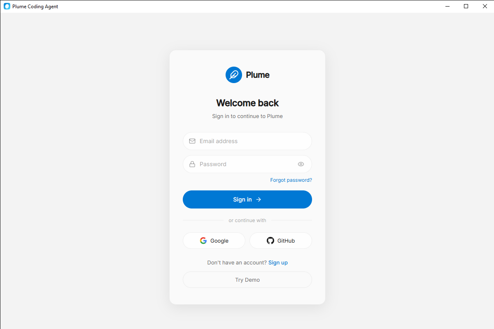

# Plume Code Agent

Full-stack AI-powered desktop coding assistant built with **Tauri (Rust) + React + Node.js**.

> 120fps optimized UI with 150+ dynamic icons, models.dev integration, 25+ free AI models.

**GitHub:** [github.com/Panker199/Plume](https://github.com/Panker199/Plume)

---

## Screenshots

### Login


---

## Features

### AI Chat
- Streaming responses with real-time token generation
- 150+ dynamic state-aware icons (thinking, coding, debugging, analyzing...)
- Smart recommendations based on task type
- Cost estimation before running prompts

### 120fps Performance
- CSS GPU acceleration (`will-change`, `transform:translateZ(0)`, `contain:layout`)
- React `useMemo` / `useCallback` / `React.memo` optimizations
- Content-visibility auto for off-screen rendering
- Compositor-only animations (transform + opacity)

### models.dev Integration
- Dynamic model discovery from models.dev catalog
- Only FREE models (cost.input = 0, cost.output = 0)
- 25+ verified free models
- Smart filtering: Recommended, Coding, Reasoning, Fast, Free
- Cost estimation API
- Local cache with 24h refresh

### UI/UX
- Dark/Light theme with custom accent colors
- Login/Signup with social auth (Google, GitHub)
- Quick actions: Debug, Write, Review, Explain code
- Responsive sidebar with conversation history
- Command palette (Ctrl+K)
- File explorer
- Git panel
- Settings with theme & accent color customization

---

## Tech Stack

| Layer | Technology |
|-------|------------|
| Desktop | Rust, Tauri 1.6 |
| Frontend | React 18, TypeScript, Vite |
| Backend | Node.js, Express 4, TypeScript |
| Model Catalog | models.dev SDK |
| Animation | CSS GPU-accelerated, 120fps |

---

## AI Models (Free)

All models are **completely free** via OpenRouter.

| Model | Context | Best For |
|-------|---------|----------|
| DeepSeek V4 Flash | 1M | General coding, complex tasks |
| Nemotron 3 Ultra | 1M | Long context, analysis |
| Nemotron 3.5 Lightning | 1M | Fast reasoning, speed |
| Qwen3.8 27B | 262K | Multilingual, versatile |
| Gemma 4 31B | 262K | Google AI, research |
| Inkling | 1M | Creative writing, analysis |
| North Mini Code | 256K | Code generation, technical |
| GLM 5.2 | 32K | Chinese AI, reasoning |
| Laguna S/XS 2.1 | 262K | General purpose |
| Dots3-Note Preview | 512K | Note-taking, summarization |
| Nex-N2.5-Pro/Mini | 262K | Balanced performance |
| LFM2.5-2.6B | 65K | Lightweight, fast |
| Free Models Router | 200K | Auto model selection |

---

## Project Structure

```
Plume/
├── frontend/
│   ├── src/
│   │   ├── App.tsx              # Main app layout & chat UI
│   │   ├── Auth.tsx             # Login/signup page
│   │   ├── Settings.tsx         # Settings modal
│   │   ├── ModelSelector.tsx    # Model selector with recommendations
│   │   ├── ThemeContext.tsx      # Theme & accent color provider
│   │   ├── ColorPicker.tsx      # Accent color picker
│   │   ├── FileExplorer.tsx     # File explorer panel
│   │   ├── GitHub.tsx           # GitHub integration
│   │   ├── CommandPalette.tsx   # Ctrl+K command palette
│   │   ├── CodeBlock.tsx        # Code syntax highlighting
│   │   ├── TaskList.tsx         # Task management
│   │   └── index.css            # 120fps optimized CSS
│   ├── src-tauri/               # Rust backend (Tauri commands)
│   │   ├── src/main.rs
│   │   └── tauri.conf.json
│   └── vite.config.ts
├── backend/
│   └── src/
│       ├── server.ts            # Express API server
│       ├── models-routes.ts     # models.dev API endpoints
│       └── models-service.ts    # models.dev SDK service
├── providers/                   # 100+ AI providers (models.dev)
├── models/                      # Model definitions (models.dev)
├── packages/                    # SDK packages (models.dev)
├── labs/                        # Experimental features (models.dev)
├── SKILL.md                     # Agent skill reference (500+ lines)
├── AGENTS.md                    # Model catalog guidelines
├── MODELS_INTEGRATION.md        # Integration docs
└── sync.md                      # Model sync documentation
```

---

## Prerequisites

- Node.js v18+
- Rust (latest stable)
- Tauri CLI (`cargo install tauri-cli`)
- Bun (for models.dev validation)

---

## Getting Started

```bash
# Install all dependencies
npm run install:all

# Start both frontend and backend
npm run dev
```

Or run separately:

```bash
npm run dev:backend    # Express server on port 3001
npm run dev:frontend   # Tauri dev window (Vite on 5173)
```

---

## Build

```bash
# Build for production
npm run build

# Build APK (Android)
.\build-apk.bat
```

---

## API Endpoints

### Chat & Conversations

| Method | Endpoint | Description |
|--------|----------|-------------|
| GET | `/api/health` | Health check |
| GET | `/api/conversations` | List all conversations |
| POST | `/api/conversations` | Create new conversation |
| GET | `/api/conversations/:id` | Get conversation by ID |
| DELETE | `/api/conversations/:id` | Delete conversation |
| POST | `/api/conversations/:id/messages` | Add message to conversation |
| POST | `/api/chat` | Chat with SSE streaming |

### models.dev Integration

| Method | Endpoint | Description |
|--------|----------|-------------|
| GET | `/api/models/dev` | Catalog stats |
| GET | `/api/models/dev/openrouter` | OpenRouter models |
| GET | `/api/models/dev/free` | Free models only |
| GET | `/api/models/dev/coding` | Coding models |
| GET | `/api/models/dev/search?q=query` | Search models |
| GET | `/api/models/dev/recommend?task=coding` | Smart recommendations |
| POST | `/api/models/dev/estimate` | Cost estimation |
| POST | `/api/models/dev/refresh` | Refresh catalog |

---

## Model Selection Rules

1. **Always show FREE models only** (cost.input = 0, cost.output = 0)
2. **Prioritize tool_call = true** for coding tasks
3. **Show context window size** (larger = better for long conversations)
4. **Display pricing info** for transparency
5. **Cache model list locally** (24h refresh)

---

## Smart Recommendations

| Task Type | Criteria |
|-----------|----------|
| Coding | tool_call = true, large context |
| Analysis | reasoning = true |
| Fast | Smaller context, faster responses |
| Chat | Largest context available |

---

## Performance (120fps)

### CSS Optimizations
- `contain: layout style` - isolates layout/paint
- `content-visibility: auto` - skips off-screen rendering
- `will-change: transform` - promotes to GPU layer
- `transform: translateZ(0)` - forces hardware acceleration
- `-webkit-overflow-scrolling: touch` - smooth scrolling on iOS
- Thin scrollbars (`scrollbar-width: thin`)

### React Optimizations
- `React.memo` on MessageItem, ActionCard, NavItem, ModelItem
- `useCallback` on all event handlers
- `useMemo` on filteredModels, commands
- Compositor-only animations (transform + opacity only)
- `cubic-bezier(0.16, 1, 0.3, 1)` timing functions

---

## License

MIT

---

**Made with by Panker199**
